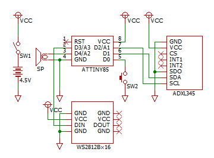
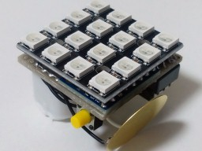
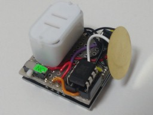
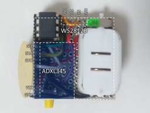
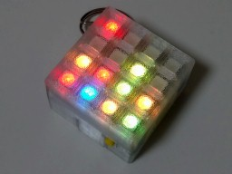

# ATtiny85LED2048

A clone of 2048 puzzle game with ATtiny85.

## Instruction

Tilt the device to move the lights. Lights with the same color merge into one when they touch. Add them up to reach white as 2048!

Color     |Number|Color     |Number|Color     |Number|Color     |Number
----------|------|----------|------|----------|------|----------|------
Red       |2     |Orange    |4     |Yellow    |8     |Lime green|16
Green     |32    |Sky blue  |64    |Blue      |128   |Purple    |256
Pink      |512   |Pale pink |1024  |White     |2048  |          |

* Button short press: Change the brightness in 4 levels.
* Button long press: Toggle sound on/off.

To calibration, keep the device upside down and flat for a while. Then the device will be in test mode to be checked tilt sensing. Press the button to recover to normal mode.

## Hardware

### Components

* An [ATtiny85](https://akizukidenshi.com/catalog/g/g109573/)
* A [3 axis accelerometer module with ADXL345](https://akizukidenshi.com/catalog/g/g107234/)
* [WS2812Bs arranged as 4&times;4](https://eleshop.jp/shop/g/gL1F316/)
* A battery holder and battery(ies)
* A slide switch
* A tactile switch
* A piezo buzzer
* Wires, connectors, etc...

### Schematic

### Examples

## Software

### Build environment

[Install ATTinyCore boards to the Arduino IDE](https://github.com/SpenceKonde/ATTinyCore/blob/master/Installation.md) and configure the settings as follows.

Attribute        |Value
-----------------|------------------------------
Board            |ATtiny25/45/85 (No bootloader)
Chip             |ATtiny85
Clock            |8 MHz (Internal)
B.O.D. Level     |B.O.D. Disabled (saves power)
Save EEPROM      |EEPROM retained
Timer 1 Clock    |CPU (CPU frequency)
LTO              |Enabled
millis()/micros()|Enabled

This sketch depends on following library. (You can add this by library manager)

* [Adafruit NeoPixel](https://github.com/adafruit/Adafruit_NeoPixel)

### Acknowledgement

* [SimpleWire.h](https://lab.sasapea.mydns.jp/2020/03/11/avr-i2c-2/)
  * Copyright (c) 2020 Sasapea's Lab. All right reserved.

### License

These codes are licensed under [MIT License](LICENSE).

## References

* [Tiny2048 | Hackaday.io](https://hackaday.io/project/197115-tiny2048)
* [2048 by Gabriele Cirulli](https://play2048.co/)
